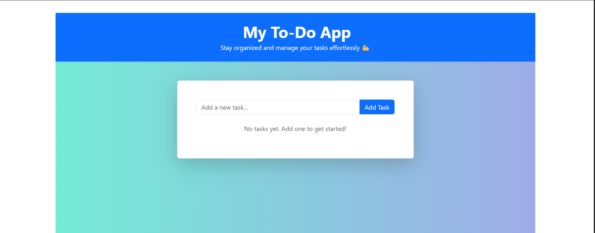
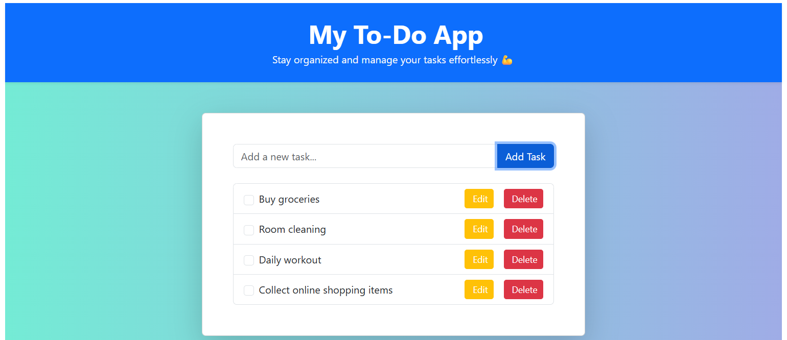
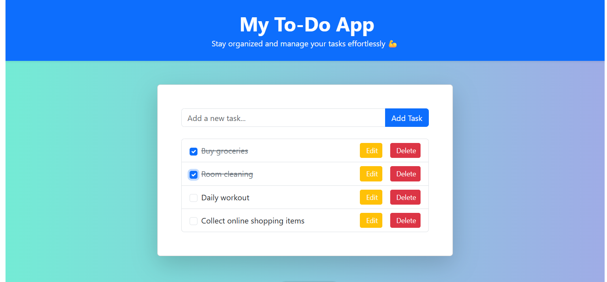
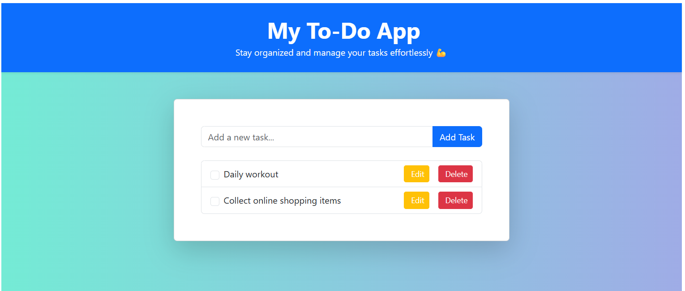
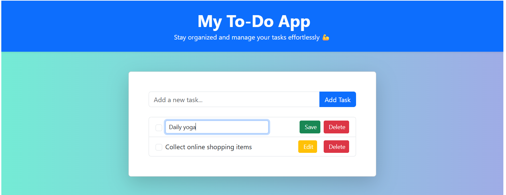
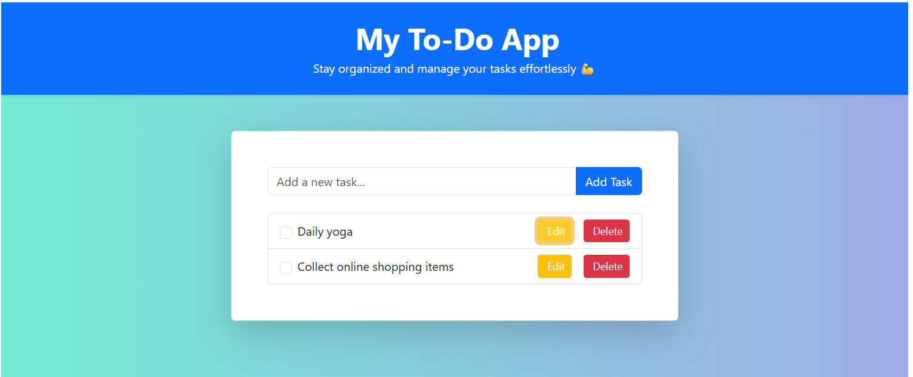

# 📝 My To-Do App

A simple and elegant task management application built with **React** and **Bootstrap**. This app helps users stay organized by allowing them to add, edit, complete, and delete tasks effortlessly.

## 🚀 Features

- ✅ Add new tasks
- ✏️ Edit existing tasks
- ✔️ Mark tasks as completed
- 🗑️ Delete tasks
- 🎨 Responsive UI with Bootstrap styling
- 💾 State management using React Hooks

## 📁 Project Structure
src/ ├── components/ │   ├── Header.jsx │   ├── ToDoList.jsx │   └── ToDoItem.jsx ├── App.jsx ├── App.css └── index.js

## 🛠️ Technologies Used

- [React](https://reactjs.org/)
- [Bootstrap](https://getbootstrap.com/)
- [React Icons / Bootstrap Icons](https://icons.getbootstrap.com/)

## 🧑‍💻 How to Run the Project

### 1. Clone the repository

```bash
git clone https://github.com/anistars/to-do-list-app.git
cd my-todo-app

npm install

npm run dev
The app will run at http://localhost:port_number/ by default.

Basic layout


Adding tasks


Strike out completed tasks


Deleting completed tasks


Update of task


Updated task
